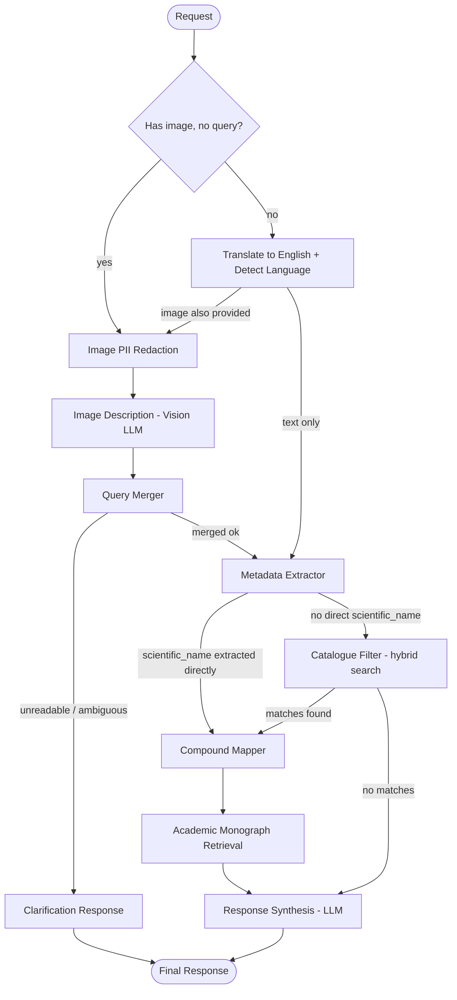

# Egyptian Drug Database Pipeline Assistant

[]()
[]()
[]()
[]()
[]()
[]()
[]()
[](https://egyptian-drug-assistant-chatbot.streamlit.app/)

**[Try the live demo →](https://egyptian-drug-assistant-chatbot.streamlit.app/)**

A production-shaped, multilingual, multimodal **agentic retrieval pipeline** over Egypt's commercial drug catalogue (25,000+ products), built as a portfolio piece to demonstrate how I design and implement real agentic AI systems end to end — orchestration, retrieval, privacy, resilience, observability, and deployment.

The system accepts **text or a photo** in **English, Egyptian Arabic, MSA, or Arabizi**, normalizes every query into canonical English, extracts structured search filters, runs a two-stage typo-tolerant hybrid search over the commercial catalogue, resolves each product's active ingredients against an academic monograph dataset, and generates a grounded, catalogue-cited answer — with a fail-closed PII redaction step in front of every uploaded photo.

---

## Why This Project

I built this to show, in one repository, how I approach the hard parts of shipping an LLM system rather than just calling a chat API:

- **Graph-based multi-agent orchestration** with explicit typed state, conditional routing on what the request actually contains (text-only, image-only, image+caption), and branch-and-rejoin control flow — not a single monolithic prompt.
- **Multi-provider LLM resilience**: every reasoning step goes through one fallback client that can route across Anthropic, Groq, OpenAI, Gemini, and local Ollama, trying routers in sequence and returning a validated Pydantic object or raising, never a silently malformed one.
- **Privacy-by-construction on images**: any uploaded photo is OCR'd and NER'd for PII and redacted *before* it ever reaches the vision model — with a fail-closed default (missing engine, decode error, or unsupported source all block the image rather than forward it raw).
- **A two-stage search engine built for real-world typos and mixed-script input**: deterministic exact-match first, then a character-n-gram BM25 recall stage + RapidFuzz precision rerank, with Arabic-script normalization (diacritics, tatweel, Egyptian transliteration letters) and automatic field routing by script.
- **A build-once/read-many data pipeline for compound resolution**: matching a commercial product's raw ingredient string to an academic monograph is a batch job with a human-reviewed fuzzy queue, not a runtime LLM call — the running app only ever does a dict lookup.
- **Operational maturity**: per-agent latency instrumentation on every graph node, a `PipelineStageError` that carries the failing stage, its elapsed time, every prior stage's timing, and the state snapshot going into the failure, a content-hashed search-index cache, and a real CI pipeline.

The Egyptian drug catalogue is the demonstration surface. The architecture — multimodal ingestion → image PII redaction → language normalization → structured extraction → hybrid catalogue search → compound resolution → grounded generation — generalizes directly to other structured-catalogue, multilingual assistant use cases (e-commerce product lookup, regulatory/compliance catalogues, multilingual customer-support triage).

---

## Core Capabilities

### 1. Multimodal Input Handling
A request can carry text, an image, or both. The graph's entry router (`api/graph_builder.py`) branches on exactly what is present: a bare image skips straight to `image_pii`, an image with a caption still runs the caption through `translator_to_eng` first, and a text-only query goes straight to translation — all three paths converge before metadata extraction.

### 2. Fail-Closed Image PII Redaction
- `agents/image_pii` decodes an uploaded base64 data URI (a caller-supplied plain URL is deliberately **never fetched** — fetching it server-side would be an SSRF risk) and runs it through a Presidio `ImageRedactorEngine` (OCR + NER) before anything reaches the vision model.
- The redactor is built lazily on a background thread on first use, with a bounded wait per call, so a slow model load never blocks the request that triggered it.
- Every failure mode — missing engine, unsupported source, decode error, redaction exception — blocks the image (`image_cleaned = None`) rather than forwarding it unredacted; `image_describer` explicitly refuses to fall back to the raw `image` field.

### 3. Multilingual Query Layer
```text
User input (English / Egyptian Arabic / MSA / Arabizi / mixed; text or a photo caption)
        ↓
LLM-based translation + language ID (agents/translatore_to_eng) -> canonical English + detected language
        ↓
Structured metadata extraction, catalogue search, compound resolution, and response generation — entirely in English
        ↓
The final response is generated directly in the user's detected language, so nothing needs translating back
```
An unreadable or ambiguous photo doesn't fall through to a guessed search — `query_merger` can short-circuit straight to `END` with a clarification message rendered in the user's own detected language (English / Egyptian Arabic / MSA / Arabizi templates).

`translator_to_eng` and `early_responser` are both conversation-aware: they read `chat_hist`, a list of prior turns each shaped `{"eng_query": "...", "response": "..."}` (the English query already produced for that turn and the answer given for it — never the raw untranslated transcript). The translator uses it only to infer language on an ambiguous one-word follow-up and to splice a missing drug name into a bare ellipsis ("و الجرعة؟"); the responder uses it to resolve pronouns and follow-ups like "and the price?" against what was already asked and answered. Neither ever treats prior history as a source of drug facts — only live retrieval `content` is grounding.

### 4. Structured Extraction over Free-Text Search
Rather than embedding the query and searching semantically, `meta_data_extractor` asks an LLM to pull out exactly the fields the catalogue is actually indexed on — `commercial_name_en/ar`, `scientific_name`, `manufacturer`, `drug_class`, `route`, and a `price_egp` expression (a bound like `<20` / `10-30`, or a sort directive `asc`/`desc`). `meta_data_filter` then runs each populated field as its own catalogue lookup and OR's the results together, so a query that could mean either a brand or an ingredient isn't forced to guess which.

### 5. Two-Stage Hybrid Catalogue Search
`agents/meta_data_fiter/search_engine.py`'s `MedicineSearchEngine` runs over 25,000+ commercial records, 5 fields each:
1. **`exact_match`** — deterministic, no-scoring word-intersection lookup; a correctly-spelled query is answered here without ever touching BM25 or fuzzy matching.
2. **`search`** (fallback only) — character 2-and-3-gram **BM25** for recall, combined with **RapidFuzz** (`WRatio` / `token_sort_ratio`) for precision, over a script-routed field subset (Arabic-heavy queries only search `*_ar` fields, and vice versa) — with full Arabic normalization (diacritics, tatweel, hamza/alef/ya unification, Egyptian transliteration letters چ/ڤ/پ/گ) and dosage-form/pack-size noise stripping.

The engine is built once per process (~6s) and then persisted to a content-hash-keyed pickle cache (~1.3s to reload), rebuilt automatically the moment the source catalogue file changes.

### 6. Build-Time Compound Resolution, Runtime Dict Lookup
Resolving a commercial product's raw `scientific_name` string (e.g. `"PARACETAMOL(ACETAMINOPHEN)+CAFFEINE"`) to the academic dataset's canonical `generic_name` is **not** a runtime LLM call:
- `scripts/build_compound_map.py` runs offline, once per data update, over every distinct ingredient component: exact match → parenthetical-alias match → RapidFuzz fuzzy candidate (score ≥ 97, never auto-accepted — routed to `review_queue.json` for a human to promote). Writes `compound_map.json`, `unmapped_report.json`, and `review_queue.json` to `data/generated/`.
- `agents/compound_mapper` at runtime just loads `compound_map.json` and does a plain dict lookup per component — no fuzzy matching, no LLM, and an unmatched component is logged (`logs/unmapped_compounds.jsonl`) rather than guessed at.
- `agents/retreivale` (academic retrieval) then attaches each resolved compound to its monograph record from `data/*.json`, appending to — never replacing — the commercial rows `meta_data_filter` already found.

### 7. LLM Orchestration & Resilience
- A provider-agnostic `Llm` factory (`llm/llm_models.py`) wraps **Anthropic, Groq, OpenAI, Google Gemini, and local Ollama** behind one interface.
- A `FallBack` router (`llm/fallback.py`) tries routers in sequence and returns a validated Pydantic object via `with_structured_output(..., method="json_schema")` — native constrained decoding, not tool-calling, avoiding Groq's "model did not call a tool" failure mode under forced tool choice.
- Every agent goes through the same `fallback_client.constrained_invoke(...)` entry point, so adding a new model or reordering providers is a one-line change in `llm/client.py`, not a per-agent edit.

---

## Architecture



This graph is built with **LangGraph** (`api/graph_builder.py: GraphBuilder.build`) over a typed `TypedDict` `State` (`models/state.py`) shared by every node — conditional edges decide the route at three separate points (entry, post-translation, post-extraction) based only on what the state already contains.

### Agent Reference

| Node (`api/workflow.py`) | Module | Role |
|---|---|---|
| `translator_to_eng` | `agents/translatore_to_eng` | Translate the query/caption to canonical English and detect the user's language, using `chat_hist` (`eng_query`/`response` pairs) to resolve an ambiguous short input or a bare follow-up ellipsis |
| `image_pii` | `agents/image_pii` | Presidio-based OCR + NER image redaction, fail-closed |
| `image_describer` | `agents/image_describer` | Vision-LLM structured description of the redacted photo (package / blister / bottle / prescription / shelf / other) |
| `query_merger` | `agents/query_merger` | Fuses the image description with any caption into one search query, or routes to a localized clarification response |
| `meta_data_extractor` | `agents/meta_data_fiter/query_extractor` | Extracts structured catalogue filters from the English query |
| `meta_data_filter` | `agents/meta_data_fiter/agent` | Two-stage hybrid search over the commercial catalogue |
| `compound_mapper` | `agents/compound_mapper` | Dict-lookup resolution of ingredient strings to academic `generic_name`s (build-time artefact, no LLM) |
| `retrieve_academic` | `agents/retreivale` | Attaches each resolved compound to its academic monograph |
| `early_responser` | `agents/early_responser` | Grounded, catalogue-cited answer synthesis in the user's own language, using `chat_hist` to resolve what a follow-up query refers to |

---

## Repository Structure

```text
.
├── agents/
│   ├── translatore_to_eng/     # query/caption translation + language detection
│   ├── image_pii/               # Presidio OCR+NER image redaction (fail-closed)
│   ├── image_describer/         # vision-LLM structured photo description
│   ├── query_merger/            # image+caption fusion, localized clarification templates
│   ├── meta_data_fiter/
│   │   ├── query_extractor/     # LLM extraction of catalogue search filters
│   │   ├── agent/                # meta_data_filter node + filter helpers
│   │   ├── search_engine.py      # MedicineSearchEngine: exact-match + BM25/RapidFuzz hybrid
│   │   └── engine_registry.py    # process-wide cached engine, content-hash keyed
│   ├── compound_mapper/          # runtime dict-lookup + normalization + build artefacts
│   ├── retreivale/                # academic monograph attachment
│   └── early_responser/           # grounded answer synthesis
├── llm/
│   ├── llm_models.py               # multi-provider chat model factory
│   ├── fallback.py                  # FallBack router (plain + constrained/structured invoke)
│   ├── client.py                     # configured FallBack instance + router order
│   └── prompt_loader.py               # markdown prompt loading (prompts/)
├── api/
│   ├── app.py                          # FastAPI entry point (lifespan warm-up, /health)
│   ├── endpoints.py                     # per-agent + full-pipeline REST routes
│   ├── workflow.py                       # instrumented pipeline runner (per-node latency, PipelineStageError)
│   └── graph_builder.py                   # LangGraph StateGraph construction and routing
├── scripts/
│   └── build_compound_map.py               # offline build: commercial ingredients -> academic generic_name
├── models/                                  # Pydantic schemas per agent + the shared State TypedDict
├── prompts/                                  # markdown system/human prompt sources
├── data/
│   ├── egyptian-drugs.json                    # commercial catalogue (25k+ products)
│   ├── *.json (numeric stem)                   # academic monograph records, one file per source PDF
│   └── generated/                               # compound_map.json / unmapped_report.json / review_queue.json
├── cache/                                        # content-hash-keyed pickled search-engine cache
├── logs/unmapped_compounds.jsonl                  # runtime log of ingredient strings with no compound_map hit
├── tests/                                          # pytest suite
├── config.py                                        # typed settings, reads .env
├── model_manager.py                                  # local-directory-first model download/caching
├── streamlit_app.py                                   # chat UI, embedded API launch, per-agent API tester
├── Dockerfile                                          # multi-stage, CPU-only image
└── requirements.txt
```

---

## Tech Stack

| Layer | Technology |
|---|---|
| Orchestration | LangGraph (`StateGraph`), LangChain |
| API | FastAPI + Uvicorn |
| Demo UI | Streamlit |
| LLM providers | Anthropic, Groq, OpenAI, Google Gemini, local Ollama (unified fallback layer) |
| Catalogue search | `rank_bm25` (character n-gram recall) + RapidFuzz (precision rerank) |
| Compound matching | RapidFuzz (build-time only), pure Python normalization |
| Image PII redaction | Microsoft Presidio (analyzer + image redactor), spaCy, Tesseract OCR (`pytesseract`) |
| Validation / schemas | Pydantic v2 |
| Testing / CI | pytest, GitHub Actions |
| Deployment | Docker (multi-stage, CPU-only) |

---

## Running It Locally

A hosted version of this app is live at **https://egyptian-drug-assistant-chatbot.streamlit.app/** — no setup required. The steps below are for running it yourself.

### Prerequisites
- Python 3.12
- API keys for at least one of Anthropic / Groq / OpenAI / Gemini (see below) — Groq is the only router currently wired into the active fallback order (`llm/client.py: FALLBACK_ORDER`)
- On Linux: the `tesseract-ocr` system package (already listed in `packages.txt`, used by the Dockerfile); on Windows, install the [Tesseract OCR](https://github.com/UB-Mannheim/tesseract/wiki) binary if you plan to exercise image PII redaction locally.

### 1. Clone and install
```bash
git clone https://github.com/ramhany-coder/Drug-assistant-agent.git
cd Drug-assistant-agent

python -m venv .venv
source .venv/bin/activate        # Windows (PowerShell): .venv\Scripts\Activate.ps1

pip install -r requirements.txt
```

### 2. Configure environment variables
Copy `.env.example` to `.env` and fill in at least one LLM provider key:
```text
ANTHROPIC_API_KEY=
GROQ_API=
GPT_API=
GEMINI_API=
OLLAMA_PATH=http://localhost:11434

ENABLE_IMAGE_PII=true
PII_SPACY_MODEL_NAME=en_core_web_sm
PII_SPACY_MODEL_DIR=models/pii_spacy
WARM_UP_PII_ON_STARTUP=true
```

### 3. Search index and compound map
The commercial search index is built automatically on first run (or eagerly at FastAPI startup via `warm_up_commercial_engine()`) and cached to `cache/`, keyed by a hash of `data/egyptian-drugs.json` — no manual build step needed. The compound map is a separate, checked-in artefact; only rebuild it after changing `data/*.json` or `agents/compound_mapper/compound_aliases.py`:
```bash
python scripts/build_compound_map.py
```

### 4. Run it
**Option A — Streamlit demo (recommended for a first run):**
```bash
streamlit run streamlit_app.py
```
This launches the full chat UI *and* boots the FastAPI backend automatically in a background thread — one command, nothing else to start.

**Option B — API only:**
```bash
uvicorn api.app:app --reload
```
Then hit `GET /health` or `POST /api/pipeline/run` with a JSON body of `{"query": "...", "image": null, "chat_hist": []}`.

---

## API Reference

| Method | Path | Purpose |
|---|---|---|
| `GET` | `/health` | Liveness check (used by the Docker `HEALTHCHECK`) |
| `POST` | `/api/translate` | Runs `translator_to_eng` standalone |
| `POST` | `/api/extract` | Runs `meta_data_extractor` standalone |
| `POST` | `/api/filter` | Runs `meta_data_filter` (hybrid catalogue search) standalone |
| `POST` | `/api/map_compounds` | Runs `compound_mapper` standalone |
| `POST` | `/api/retrieve_academic` | Runs `retrieve_academic` standalone |
| `POST` | `/api/respond` | Runs `early_responser` standalone |
| `POST` | `/api/pipeline/run` | Runs the full compiled graph end to end; returns the final state plus per-stage and total latency |

Every full-pipeline failure raises a structured error carrying **which** stage failed, how long it ran before failing, the latencies of every stage that completed before it, and the partial state — surfaced as an HTTP 500 with full diagnostic detail rather than a bare stack trace (`api/workflow.py: PipelineStageError`).

---

## Testing & CI

```bash
pytest -v
```

| Suite | What it verifies |
|---|---|
| `tests/test_search_engine.py` | `MedicineSearchEngine`'s exact-match and hybrid BM25/RapidFuzz search over real catalogue-shaped data, including Arabic normalization |
| `tests/test_engine_registry.py` | Content-hash cache build/load/rebuild behavior |
| `tests/test_normalize.py` | Compound-string normalization (salts, aliases, parentheticals, strengths) |
| `tests/test_build_compound_map.py` | The offline exact/parenthetical/fuzzy-review matching cascade |
| `tests/test_compound_map.py` / `test_compound_mapper_node.py` | Runtime dict-lookup behavior of the `compound_mapper` node |
| `tests/test_retrieve_academic.py` | Academic monograph attachment onto existing commercial context |
| `tests/test_meta_data_filter.py` | End-to-end filter behavior (route/price hard filters, multi-field OR matching) |
| `tests/test_image_pii.py` | Fail-closed behavior of the image redaction node |

GitHub Actions (`.github/workflows/ci.yml`) runs the full suite on every push/PR to `master`: installs dependencies, copies `.env.example` to `.env` so CI exercises the same default configuration a fresh clone would.

---

## Deployment

- **Docker**: a multi-stage `Dockerfile` builds against a slim Python base (no `torch`/`sentencepiece`/vector-DB dependencies in this app, so no heavyweight build stage is needed), installs only `tesseract-ocr` for image PII, and ships a container `HEALTHCHECK` against `/health`.

---

## Engineering Highlights

- **Fail-closed image privacy, not fail-open.** Every branch of `image_pii` — no engine, unsupported source, decode failure, redaction exception — blocks the image outright; `image_describer` never falls back to the raw upload.
- **Lazy, bounded, background model initialization.** The Presidio image-redaction engine is constructed on a background thread the first time it's actually needed, with a bounded wait per call — a slow load doesn't block the request that triggered it, but the next call still picks up the finished engine instead of giving up permanently.
- **Exact match before fuzzy, always.** `MedicineSearchEngine.exact_match` answers a correctly-spelled query with a deterministic word-intersection lookup; the BM25 + RapidFuzz path only runs at all when that returns nothing, so the common case never pays for fuzzy scoring it doesn't need.
- **Matching is a build artefact, not a runtime decision.** `compound_mapper` used to run fuzzy matching and LLM disambiguation live; it's now a pure dict lookup against `data/generated/compound_map.json`, produced by an offline script with a human-reviewed queue for anything fuzzy — a component that "should" resolve but doesn't means the build script needs rerunning, not a code bug.
- **Structured extraction over blind semantic search.** The catalogue is filtered on the exact fields it's indexed by (brand name, scientific name, manufacturer, class, route, price), extracted by an LLM into a validated schema — not embedded and searched by vague similarity.
- **Provider-agnostic LLM layer with one call site.** Every agent calls the same `fallback_client.constrained_invoke(...)`; adding a provider or reordering fallback priority is a one-line change in `llm/client.py`, not a per-agent edit.
- **Per-agent observability without touching the graph.** `api/workflow.py` wraps every node with a timer that records into `state["stage_timings"]`, so latency instrumentation is a pure decoration layer over `graph_builder.py`'s routing logic.
- **Diagnostic-rich failures.** `PipelineStageError` carries the failing stage, its elapsed time, every prior stage's timing, and the state snapshot going in — surfaced as a structured HTTP 500, not a bare stack trace.

---

## Limitations

This is a portfolio-grade, production-*shaped* prototype — not a certified pharmacy or medical information system.

- The academic monograph dataset is only partially built: as of now just one of the ten source formulary PDFs has been parsed into structured records, so most ingredient strings in the commercial catalogue don't yet resolve to a monograph (`data/generated/unmapped_report.json` tracks this — currently thousands of unmapped components against a handful of mapped ones). `agents/compound_mapper/academic_index.py` picks up new `data/<n>.json` files automatically once they're parsed, with zero code changes.
- `llm/client.py`'s `FALLBACK_ORDER` currently lists Groq only — the multi-provider factory supports Anthropic/OpenAI/Gemini/Ollama, but no fallback chain across them is active until credentials are configured and the order is extended.
- Answer quality is bounded by what the structured extractor pulls out and what the hybrid search actually matches; an extraction that misreads a brand name as a scientific name (or vice versa) is mitigated by OR-ing both fields' results, not eliminated.
- Image analysis quality depends on photo clarity; an illegible or ambiguous photo is caught by `query_merger`'s clarification path, but a *misleading* one (readable but wrong) is not.
- This system assists with Egyptian drug catalogue lookup and general drug information; it is not a substitute for a licensed pharmacist, physician, or an official regulatory determination.

---

## Author

**Ram Hany**

[LinkedIn](https://www.linkedin.com/in/ram-hany-96a34b35a) · [GitHub](https://github.com/ramhany-coder) · ramyhany5678@gmail.com

**Other projects:** [Multilingual Multimodal RAG Engine for OSHA 29 CFR Part 1926](https://github.com/ramhany-coder/Advanced-multi-model-Safety-Eng.-RAG-project) — another agentic AI system.
